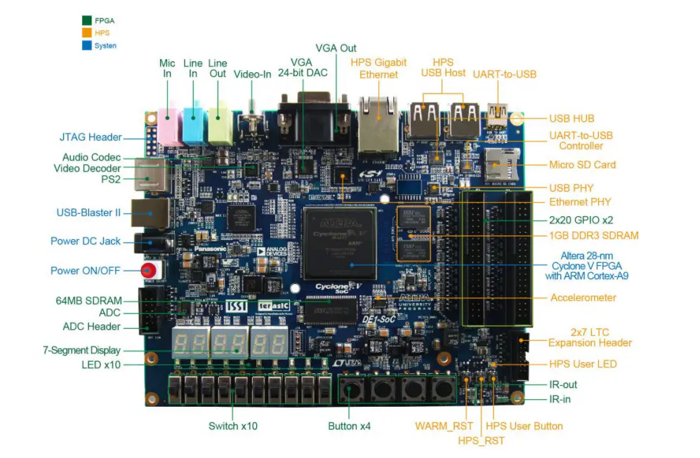

# 🎥 DE1-SoC – Kit FPGA com Suporte a Processamento de Vídeo

O kit **DE1-SoC** da Terasic (Intel/Altera) é uma plataforma robusta para aplicações de **processamento de vídeo em tempo real**, ideal para ensino, pesquisa e prototipagem de sistemas embarcados que envolvam **sinais de vídeo, imagens e visão computacional**.

---

## 📷 Imagem do Kit

---

## 🎯 Especificações para Processamento de Vídeo

| Item                             | Descrição                                                                 |
|----------------------------------|---------------------------------------------------------------------------|
| **a) Resolução**                 | Suporte a 640×480 (VGA), 720p e até 1080p (Full HD)                       |
| **b) Taxa de quadros (FPS)**     | Até 60 FPS (dependente da lógica HDL e memória)                          |
| **c) Formato das cores**         | RGB (8/16/24 bits), suporte a YCbCr via IP Core                          |
| **d) Memória disponível**        | 1 GB DDR3 (HPS), 64 MB SDRAM (FPGA), SRAM e Flash adicionais             |
| **e) Frequência de clock de pixel** | 25.175 MHz (VGA), 74.25 MHz (720p), 148.5 MHz (1080p) gerados por PLL    |
| **f) Entrada de vídeo**          | CMOS sensor (como TRDB-D5M ou OV7670) via GPIO ou conector dedicado     |
| **g) Saída de vídeo**            | VGA (analógico RGB), HDMI (via adaptador digital)                        |

---

## 🧠 Recursos adicionais

- **FPGA**: Intel Cyclone V SoC – 5CSEMA5F31C6N
- **HPS (ARM)**: Dual-core Cortex-A9 com Linux embarcado
- **IP Cores compatíveis**:
  - Video and Image Processing Suite
  - HDMI Receiver/Transmitter
  - Frame Buffer, DMA, Color Space Converter
- **Interfaces de Comunicação**:
  - GPIO, ADC, I2C, SPI, UART
  - Ethernet, USB, SD Card

---

## 🛠 Aplicações comuns

- Processamento em tempo real de vídeo de câmera
- Filtros de imagem (Gaussiano, Sobel, FFT, Butterworth)
- Detecção de bordas, rastreamento de objetos
- Sistemas biométricos, visão artificial embarcada
- Compressão de vídeo e processamento de cor

---

## 📎 Link oficial

Mais detalhes:  
🔗 https://www.terasic.com.tw/cgi-bin/page/archive.pl?Language=English&CategoryNo=139&No=836

---